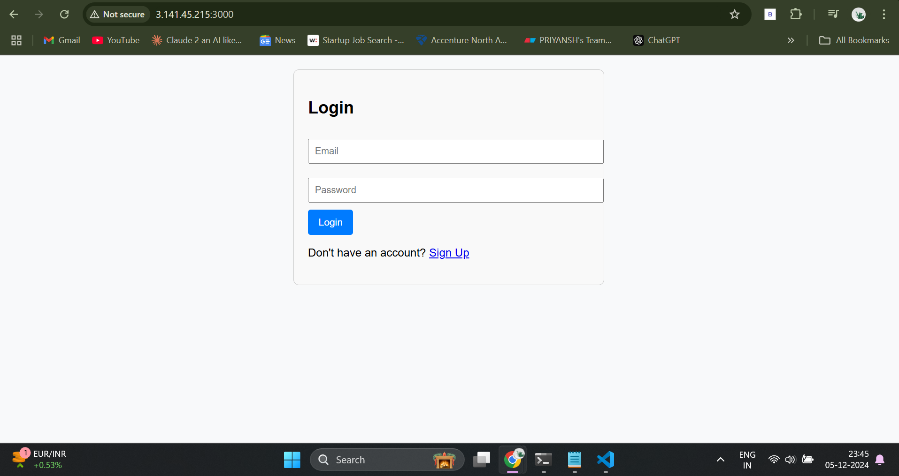

# MintTrail
A Expense Tracker Web Application (MERN Stack).   Fresh and on track with your money

## Setup  

### Backend  

1. **Navigate to the backend directory**:  
   Open your terminal and run the following command:
   ```bash
   cd backend
   ```
   
2. **nstall backend dependencies**:
Run the command to install required dependencies:

``` bash
npm install
```
3. **Set up environment variables**:
Create a .env file in the backend directory.
Add the following variables:
``` bash
PORT=5000
MONGO_URI=<your-mongodb-cloud-connection-string>
JWT_SECRET=<your-secret-key>
```
4. **Start Backend Server**:
```bash
node server.js
```


### Frontend

1. **Navigate to the frontend directory**:  
   Open your terminal and run the following command:
   ```bash
   cd frontend
   ```
   
2. **Install backend dependencies**:
Run the command to install required dependencies:

``` bash
npm install
```
3. **Start the frontend development server**:
   ``` bash
   npm start
   ```


### Database
- you can see the table schema in "models" folder in backend diretory
- my Database name : test
- tables: expenses, users


# Financerra Application Setup

Follow the steps below to build and run the frontend, backend, and MongoDB containers for the Financerra application.

## Step 1: Setup Frontend

1. **Navigate to the frontend directory**:
    ```bash
    cd frontend/
    ```

2. **Build the Docker image**:
    ```bash
    docker build -t financerra-fn .
    ```

3. **Create a Docker network** for the application:
    ```bash
    docker network create fin
    ```
    *(Note: "fin" is the name of the network for the Financerra application)*

4. **Run the frontend container in the created network**:
    ```bash
    docker run --name=fn --network=fin -d -p 3000:3000 financerra-fn
    ```

## Step 2: Run MongoDB Container

1. **Run the MongoDB container in the "fin" network** on local host port `27017`:
    ```bash
    docker run --name mongodb --network fin -p 27017:27017 -v ~/opt/data:/data/db -d mongo:latest
    ```

## Step 3: Setup Backend

1. **Navigate to the backend directory**:
    ```bash
    cd ../backend/
    ```

2. **Build the backend Docker image**:
    ```bash
    docker build -t financerra-bn .
    ```

3. **Run the backend container in the "fin" network**:
    ```bash
    docker run --name=bn --network=fin -d -p 5000:5000 financerra-bn
    ```

---


## For running docker-compose.yml file 
use Command
```bash
docker-compose up -d build
```
It will start mmanaging the containers. (May be have to change the names of volumns, etc...)
## That's It!

Now the frontend, backend, and MongoDB containers should be running in the `fin` network and accessible via the following ports:

- **Frontend**: [http://localhost:3000](http://localhost:3000)
- **Backend**: [http://localhost:5000](http://localhost:5000)
- **MongoDB**: Accessible internally at port `27017` on the `fin` network.


## Web Interface



